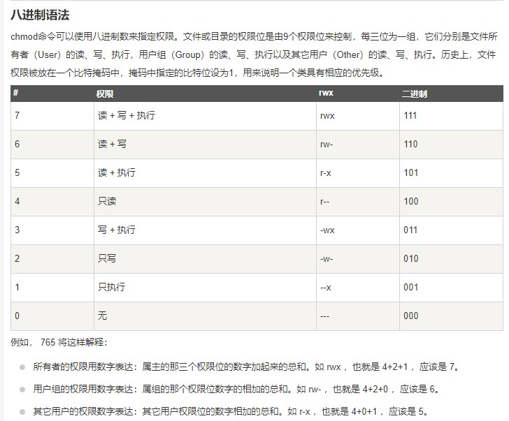
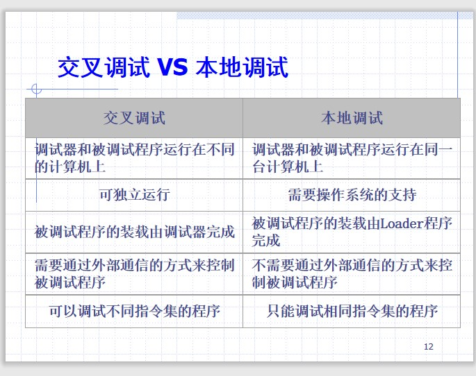
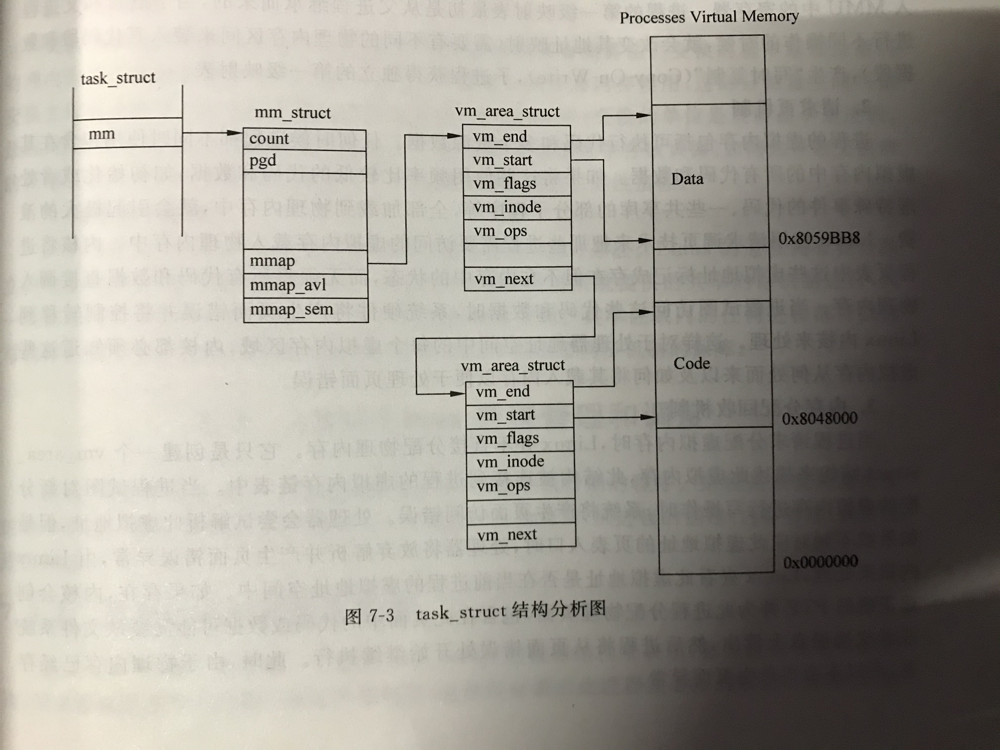

#### 时间 

11-17日 13:10~15:10

#### 题型
[题目数量-分值]

- 填空 5-10'
- 判断 10-20'
- 选择 5-10'
- 名词解释 5-25'
- 简答题 4-20'
- 综合体 1-15'

## 1.嵌入式系统概述
#### 什么是嵌入式系统？
- 以应用为中心

- 可裁剪软硬件

- 专用计算机系统

<ybg>
嵌入式系统是“控制，监视或者辅助设备，机器和车间运行的装置”
而更加普遍的理解是：以应用为中心，以计算机技术为基础，采用可裁剪软硬件，适用于堆功能、可靠性、陈本、功耗有严格要求的专用计算机系统
</ybg>

  

#### 基本结构
##### 软件平台
##### 硬件平台

#### 与传统计算机系统比较
- 应用特性
> 领体裁衣，去除冗余
- 开发能力
> 嵌入式系统不提供自主开发能力
- 其他
> 升级换代和具体产品同步进行
> 软件固化

#### 相关知识
- 嵌入式处理器结构
    - 冯-诺依曼结构
    > 输入、输出、运算、存储、控制
    - 哈佛结构
    > 将指令存储和数据存储分开
- 关键寄存器
    - CPSR
    > (Current program status register)程序状态寄存器，在用户级编程时用于存储条件码，包含条件码标志，中断禁止，当前处理器模式以及其他状态和控制信息。
    - SPSR
    > （Saved program status Register）用来保存CPSR的状态
    - PC(program counter 程序计数器)
- 指令集
    - CIRC
    > 复杂指令集计算机
    - RISC
    > 精简指令集计算机
#### 嵌入式处理器
- 嵌入式处理器分类
    - EMPU，MCE，EDSP，SOC
    > EMPU（Embedded Microprocessor Unit)嵌入式微处理器采用“增强型”通用微处理器。
    EDSP(Embedded Digital Signal Processor)嵌入式DSP处理器；SOC(System-on-chips)系统级芯片
- EMPU种类（了解）
    - MIPS,PowerPC、SH 处理器、ARM
- 区别ARMv7和ARM7 ==带不带v的区别==
> ARMv7是一个架构，而ARM7是一种处理器型号，ARM7是ARMv4架构上设计出的处理器

#### ARM特点
- 基于RISC结构
    - 固定长度、指令格式
    - 寻址方式灵活简单
- 三个系列：Cortex-A，Cortex-R，Cortex-M
    - A面向高性能
    > Cortex-A面向高性能应用，它具有长达13级的流水线，并且可以支持1-4个核
    - R面向高实时性
    > Cortex-R面向具有高实时性要求的应用，通常应用于专用集成电路(ASIC)，仍然采用8级流水线
    - M面向对能耗和价格有较高要求的客户,采用低延迟的三级流水线

#### ARM指令集
- 指令集特征
> ARM指令集属于加载/存储型指令
指令的操作数都储存在寄存器中，处理结果直接放回到目的寄存器中

- ARM和Thumb的区别

|ARM|THUMB|
|:-|:-|
|一般都可以条件执行|除了B都不能条件执行|
|32位指令|包含于ARM中，16位指令集|
|三地址结构|双地址结构|

- 8种寻址方式（书P27）
## 2.嵌入式软件-嵌入式操作系统
#### 嵌入式操作系统
- 操作系统作用
    - 系统资源管理
    - 硬件虚拟化
    - 提供资源
- 常见嵌入式系统
> uCLinux：Lineo公司主打的的“针对微控制领域而设计的Linux系统”
> RT-Linux（Real-time Linux)硬实时特性的多任务操作系统
> 红旗linux：适合多种CPU，提供多个开发环境
#### 嵌入式Linux特点
- 组成结构
- 特点（了解）

    - 内核版本稳定
    >（版本号特征：双号为稳定版本）主版本.次版本.释出版本-修改版本
    2.6.32-642.el6.x86_64
3.10.0-693.17.1.el7.x86_64
    用命令uname -r查看
  
- Linux Shell操作
    - 提示符 #和$
  > #表示root权限，$表示普通用户
- Linux编程
    - make和Makefile

#### Linux常用命令
- ls 
- cp
- rm 
- mv
- tar 
- mount 
- in
- chmod
 > Linux chmod（英文全拼：change mode）命令是控制用户对文件的权限的命令
例：chmod 777 file
Linux/Unix 的文件调用权限分为三级 : 文件所有者（Owner）、用户组（Group）、其它用户（Other Users）。

- vi
#### Linux文件权限管理（掌握—三段式文件管理）

#### Linux编程
- 编程基础
    - C语言
    - vi使用
- 编译方法
（gcc vs arm-linux-gcc)

#### Make & Makefile
- 宏的使用
    - $(宏标识符)
    - $(CC)
- Makefile命名
    - hello.makefile的编译方法

## 嵌入式存储-Flash Memory
- Non-Volatile内存
> 即断电数据也能保存，低功耗，密度高，体积小，可擦除课重写，可重复编程的特点
- 主要技术NAND和NOR
    - NAND:单元排列串行
    - NOR：单元派别并行，

#### 嵌入式系统开发模式
- 宿主机&目标机开发模式
#### 建立嵌入式Linux开发环境
- 交叉编译环境
  - 安装ToolChiain
  > 在一个架构的机器下编译另一个架构下的目标文件。
- 简历宿主机-目标机的通信连接
  - JTag口
  > JTAG功能与CPU状态无关，可驱动设备的所有外部引脚并读入数据，而且在设备内部夺取外部的连接点。
  <red>功能：测试线路连接状态和端子的连接状态；测试设备间的连接状态；进行Flash memory的烧写
</red>

  - 实现串口通信
  > 驱动实现简单，需要在宿主机目标机均提供驱动。 
#### TFTP协议建立
> Trivial file Transfer Protocal
> 可以视为简化的FTP协议，
> 安装在宿主机，TFTP客户端由目标板实现，目标板需要获取IP地址
> 不需要认证用户端权限，但是会引发安全问题
  - 利用tftp下载Linux镜像
      - 系统镜像 包含三部分：bootLoader，操作系统镜像，文件镜像
      - Linux镜像包括内核镜像和文件系统镜像

#### BootLoader
- 什么是BootLoader？
> BootLoader是操作系统内核运行前的一段小程序，通过这段小程序可以初始化硬件设备和简历内存空间的映射图。
> 不同的CPU架构下支持不同的BootLoader，U-Boot支持ARM体系结构和MIPS体系结构
- PC与嵌入式系统的启动过程与差别？

|PC|嵌入式系统|
|:-|:-|
|(1)BIOS程序|SOC芯片内嵌iROM代码|
|引导程序，将OS加载到内存|iRAM中的bootloader第一阶段代码|
|操作系统 (Linux,Windows,...)|内存中的bootloader第二阶段代码   |
- 主要工作
> 1.初始化硬件设备和建立内存空间的映射图
2.将系统的软硬件环境带到一个合适的状态
3.为最终调用操作系统内核准备好正确的环境
- Boot Loader的操作模式
> 1.启动加载模式:boot loader从固态存储中加载到RAM中运行
> 2.下载模式：通过串口下载文件，先保存到RAM，然后烧写到目标机的FLash固态存储中；这种模式下会给用户提供一个命令行接口
- Boot Loader与主机之间的通信设备及协议
    - 最常见的是串口，协议xmodem/ymodem/zmodem/==注意区分xyzmodem和modem==
    > modem：是指猫，将计算机的数字信号翻译成可沿普通电话线传送的脉冲信号。
    > xmodem/ymodem/zmodem:xmodem是串行通信中的一种简单异步文件传输协议，可以作为嵌入式设备booloader通过串口升级时的传输协议。
    ymodem：包含xmodem的所有特征，允许批处理文件传输，效率更好
    zmodem：改进型xmodem，只需要对损坏的块进行重发，其他不正确的块不需要发送确认字节。
    - 以太网，tftp
   >TFTP（Trivial file Transfer protocol）是TCP/IP协议族的一个用来在客户机和服务器之间进行简单文件传输的协议，端口为69.
  

<ybg>BootLoader的总目标是正确的调用内核来运行</ybg>

#### Boot Loader的典型结构框架
##### BootLoader 阶段一
- (1)基本硬件初始化
    - 1.屏蔽所有中断
    - 2.设置CPU速度和时钟频率
    - 3.RAM初始化
    - 4.初始化LED
- （2）为加载阶段二准备RAM空间
  <red>BOLB检测算法：以memory page为测试单位，测试每个memory page开始的两个字节是否是可读写的。</red>
    - 1.保存memory page一开始两个字的内容
    - 2.向两个字中写入任意数字
    - 3.将两个数字读回，判断是否是写入的，如果不是则不是有效的RAM空间。
    - 4.向两个字中写入任意数字
    - 5.将两个字的内容立即读回。如果不是写入的内容，则不是有效的RAM空间。
    - 6.恢复两个字的原始内容，测试完毕。
- （3）复制stage2到RAM中
  - 注意stage2的可执行镜像到的起始和终止地址
  - RAM空间的起始地址
- （4）设置堆栈指针
- （5）跳转到阶段2的入口
##### BootLoader 阶段二
- （1）初始化阶段要使用的硬件设备
- （2）检测系统的内存映射
- （3）加载内存映像和根文件系统映像
- （4）设置内核启动参数
- （5）调用内核

#### Boot Loader的使用
- 烧写Boot Loader
    - 烧写方法
- Boot Loader

## 2.2 Arm-linux内核
#### 影响内存管理的两个方面
##### 1.Linux操作系统的内存管理
1. 包含地址映射、内存空间的分配，有时候还包括地址访问的限制
2. 如果I/O也放在内存地址空间中，则还要包含I/O的映射
3. 另外，代码段，数据段，堆栈段空间的分配都属于内存管理

##### 2.MMU
- （ARM7以及以下不支持MMU，ARM9以上支持MMU）
> MMU（Memory managemet unit）是内存管理单元的缩写。
其作用主要有两个：1.地址映射；2.地址访问进行保护和限制。
简单来说，MMU提供一组寄存器，依靠这组寄存器来进行地址映射和访问保护。
严格来说，不需要地址映射就不需要MMU，但是理论上不存在这样的情况
- MMu可以做在芯片中，也可以作为协处理器
###### 3.MMU地址映射机制

> 一个进程的虚拟地址空间主要是由两个数据结构来描述，一个是最高层次的mm_struct,一个是较高层次的vm_area_structs.
> Linux内核需要TLB管理所有的虚拟内存地址，每个进程虚拟内存中的内容在其task_struct结构中指向vm_area_struct。
> 进程mm_struct的数据结构中也包含已加载可执行映像的信息和指向进程页表的指针。还包含一个指向vm_area_strcut链表的指针，每个指针代表进程中的一个虚拟内存区域。
#### 进程管理与调度
- 什么是进程？
> （P147）进程，又称任务，是一个动态的执行过程，是处于执行期的程序。
> 2.进程是系统资源分配的最小单元。
- Linux进程创建
> 从用户空间创建一个进程，创建进程需要三个系统调用sys_fork,sys_vfork,sys_clone.
> sys_fork完整地从父进程派生出一个子进程。
> sys_clone可以通过clone_flags决定要复制给子进程的资源
> sys_vfork产生了一个新的task_struct，它还是和父进程共享其余的资源，<red>不是真正的进程，只能算是线程，在自己运行结束之前一直会阻塞父进程。</red>

#### 进程调度依据
- Policy

- Priority

#### Linux模块机制
- 必要性
- 模块的代码结构
- 相关的主要命令
    - Ismod 把kernel中已经安装的modules列出来
    - insmod把某个module安装到kernel中
    - rmmod把某个没用的moduel从kernel中卸载
    - depmod制造module dependencyfile
 
#### 中断
- 一个流程和三个环节
> 从系统角度来看，中断是一个流程，要经过三个环节：中断响应，中断处理，中断返回。
> 
  
#### 系统调用
- 实现方式
  - X86
>使用INT 0x80
  - arm
> SWI，系统调用号是SWI的操作数

#### 启动和初始化

### 嵌入式文件系统
- 控制设备驱动
- Linux文件系统组织结构？

#### 常用文件系统
- 通用文件系统
    - ext2
- 常用嵌入式文件系统
    - NAND
    - NOR
    - RAM -> RAMFS
    - Network -> NFS

#### 根文件系统
#### Linux设备驱动
- 基本概念
    - 作用
    - 设备分类
    - 设备号
- Linux的设备驱动的功能
- Linux设备文件

#### 驱动程序的编写和加载

#### 同步机制

#### DMA（了解概念）

#### 嵌入式GUI（没讲，不考）

## 4.远程调试
#### GDB调试方法
- 加入-g进行调试

## 5.嵌入式应用开发-Android

